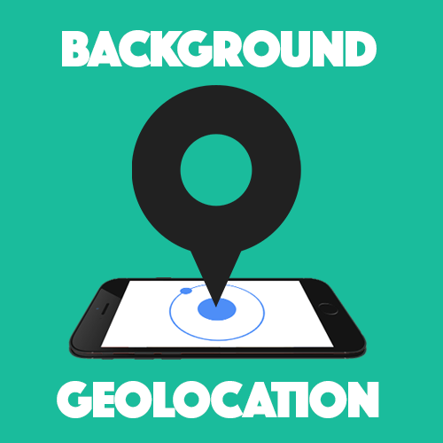

  <h1 align="center">Ionic Background Geolocation</h1>

Background Geolocation App using <strong>BackgroundLocation</strong> and <strong>Location</strong> plugins.

  

## Supporting 🍻
I believe in Unicorns 🦄
Support [me](http://www.paypal.me/jdnichollsc/2), if you do too.

Donate **Ethereum**, **ADA**, **BNB**, **SHIBA**, **USDT/USDC**, **DOGE**, etc:

> Wallet address: jdnichollsc.eth

Please let us know your contributions! 🙏

## Happy coding 💯
Made with ❤️

